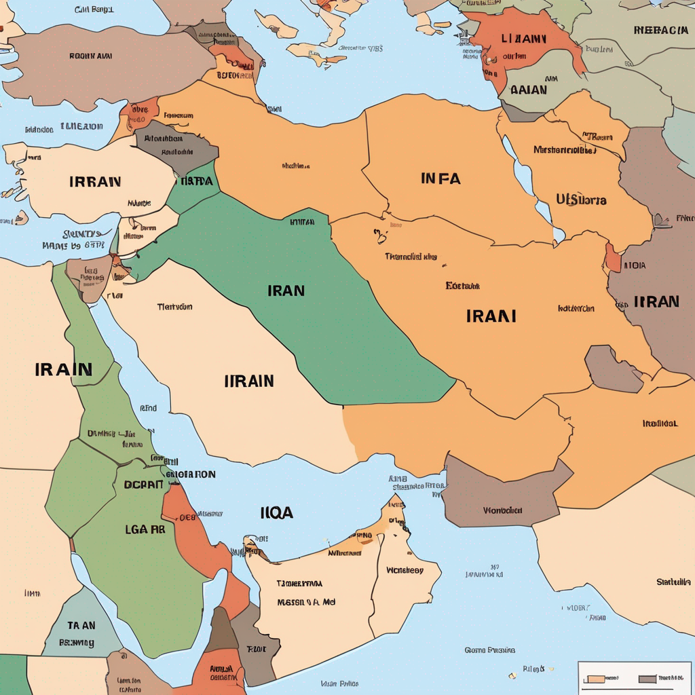

# Iran vs Iraq War and America: Latest Updates
## Introduction
The conflict between Iran and Iraq has been a longstanding issue in the Middle East, with America playing a significant role in the region. Recently, tensions have escalated, leading to a war between the two countries. This blog post provides an overview of the latest updates on the war and America's involvement.

## Background
The Iran-Iraq war has its roots in historical and cultural differences between the two countries. The current conflict is a result of escalating tensions over the past few years, with both countries engaging in proxy wars and diplomatic confrontations. The conflict has been fueled by competing interests and ideologies, with Iran seeking to expand its influence in the region and Iraq seeking to maintain its sovereignty.

## Latest Updates
As the conflict continues to unfold, there have been several significant developments. 
According to recent reports, Israel has launched a broad wave of attacks on Tehran, and the US has been targeted by Iran in retaliatory attacks. The situation is complex, with multiple countries involved, including Iraq, Israel, and the US. 
The US President has stated that the war is expected to last for approximately four weeks. 
Additionally, there have been reports of drone strikes and ballistic missile launches by Iran, targeting US bases and embassies in the region. 
The conflict has resulted in the loss of lives, including six US service members killed since the start of the war. 

## Conclusion
The Iran-Iraq war and America's involvement is a complex and sensitive issue. The latest updates indicate a significant escalation of tensions, with multiple countries involved and a high risk of further violence. It is essential to continue monitoring the situation and providing updates as more information becomes available. 

Note: The information provided in this blog post is based on the latest available updates and may not reflect the current situation. For the most up-to-date information, please refer to reputable news sources.